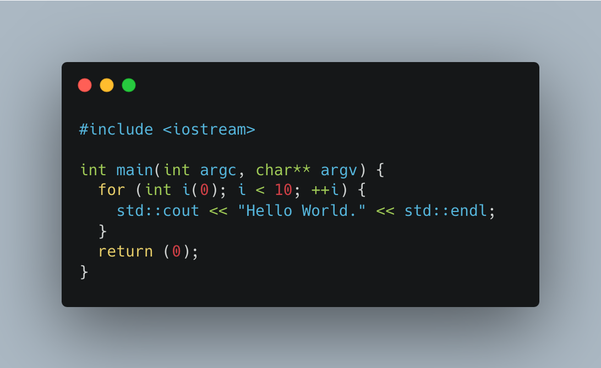
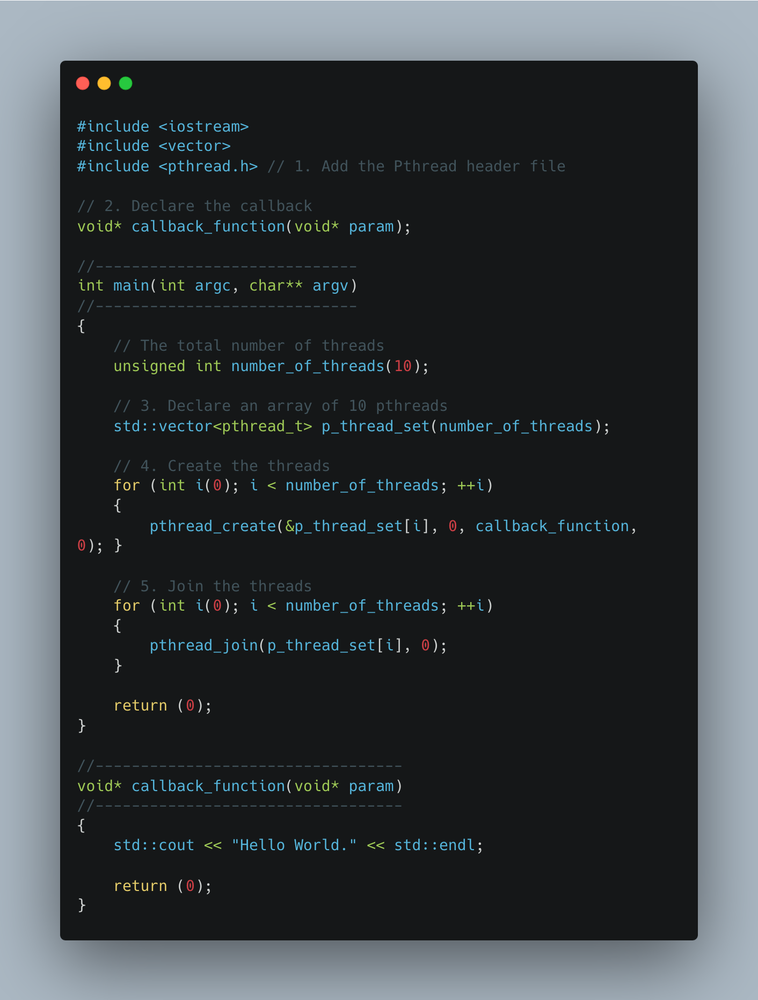
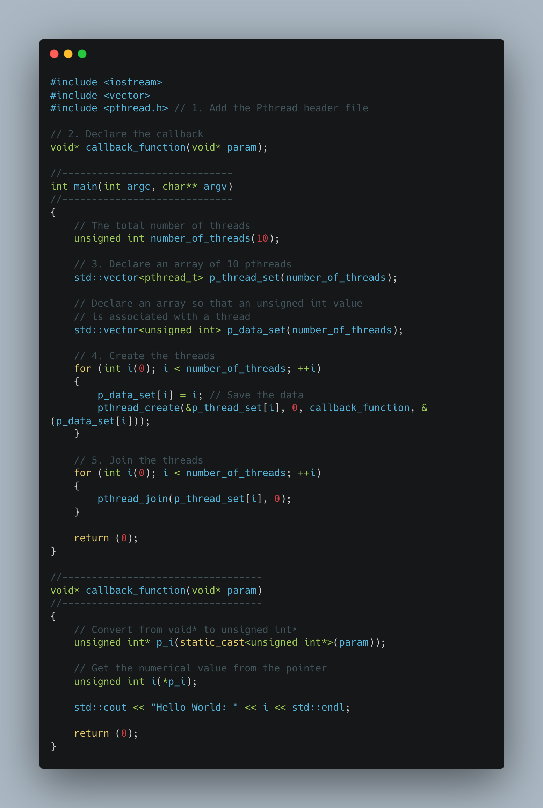
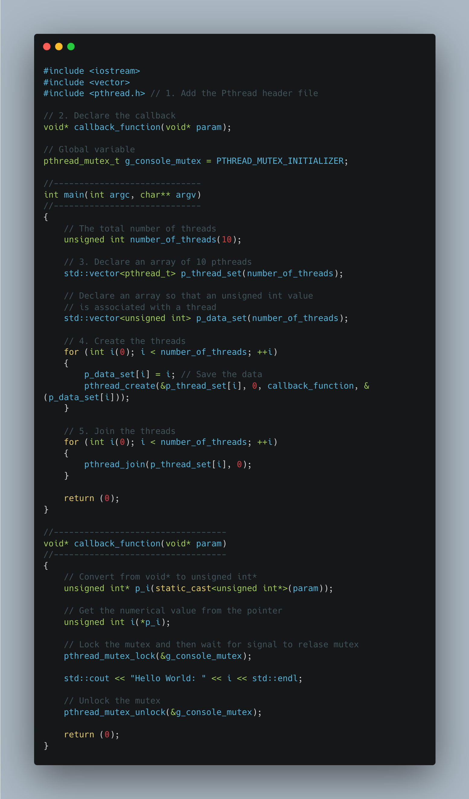

# ICE 4131 High Performance Computing - Lab 1

**Tutor:** Peter Butcher ([p.butcher@bangor.ac.uk](mailto:p.butcher@bangor.ac.uk))

**Lab Assistants**:

- Daniel Farmer ([d.farmer@bangor.ac.uk](mailto:d.farmer@bangor.ac.uk))

### Objectives

This lab will introduce you to the GNU/Linux environment used by Supercomputing Wales ([https://supercomputing.wales](https://supercomputing.wales)). You will learn how to:

- Log in
- Write and compile code
- Run your first parallel tasks using POSIX threads (aka. Pthreads)

### Task List

The tasks for this lab are as follows:

1. [Getting Access to the Supercomputer](#step-1-getting-access-to-the-supercomputer)
2. [Logging in to the Supercomputer](#step-2-logging-in-to-the-supercomputer)
3. [What you now have access to](#step-3-what-you-now-have-access-to)
4. [Basic Linux Commands](#step-4-basic-linux-commands)
5. [Compile some code](#step-5-compile-some-code)
6. [Parallelise some code](#step-6-parallelise-some-code)

---

## STEP 1: Getting Access to the Supercomputer

To begin with, you will need a user account. Follow the instructions here under “Applying for a user account”:

[https://portal.supercomputing.wales/index.php/getting-access/](https://portal.supercomputing.wales/index.php/getting-access/)

When applying for an account, you should state that you are joining project: **scw2139**

It will take some time for your account to be activated, so please be patient once you have submitted your application to join the supercomputer. If you do not have access after 2 working days, please contact the tutor. Begin reading the next steps but do not attempt to log in to the supercomputer until you are notified that your account is active!

## STEP 1B: While you wait

In the meantime, while waiting to be granted access to Supercomputing Wales, you should explore the following:

- [https://portal.supercomputing.wales/index.php/about-hawk/](About Hawk - Technical specification of the supercomputer)
- [https://portal.supercomputing.wales/](SCW Portal - Familiarise yourselves with the help topics available)
- [https://bangoroffice365.sharepoint.com/sites/DigitalServices/SitePages/eResearch-Linux-Compute-Cluster.aspx](eResearch Linux Compute Cluster - Bangor's own cluster)

If you are still waiting, log into Bangor's eResearch cluster using the instructions in the link above if connecting from a University machine. If you are connecting from your own device, you must first log in to Bangor's own SSH server: `ssh.bangor.ac.uk` and then you can SSH into the cluster from there.

---

## STEP 2: Logging in to the Supercomputer

Once you have been notified that your account has been opened, follow the instructions on the “Accessing the system” page:

[https://portal.supercomputing.wales/index.php/index/accessing-the-system/](https://portal.supercomputing.wales/index.php/index/accessing-the-system/)

Bangor users must connect to hawk via Bangor's own SSH server: `ssh.bangor.ac.uk`. Up to date instructions on connecting to Hawk for Bangor users can be found here:

[https://bangoroffice365.sharepoint.com/sites/DigitalServices/SitePages/eResearch---Access-to-the-Hawk-Supercomputer.aspx](https://bangoroffice365.sharepoint.com/sites/DigitalServices/SitePages/eResearch---Access-to-the-Hawk-Supercomputer.aspx)

> Please note: There are different instructions for accessing the supercomputer on Windows and Linux/MacOS.

Remember that when accessing Hawk, your username must be prefixed by `b.` for example:

```bash
b.abc24def
```

An example login would therefore be:

```bash
b.abc24def@hawklogin.cf.ac.uk
```

Please note: If you have 2 failed login attempts and fail to login after the third attempt, the IP address of the machine you are using will be banned from accessing the supercomputer for 24 hours. As such, if you cannot remember your password after 2 attempts, reset it at [https://my.supercomputing.wales](https://my.supercomputing.wales).

---

## STEP 3: What you now have access to

Once logged in, you will have access to:

- 201 nodes,
- totalling 8,040 cores,
- 46.080 TBytes total memory

Each node has

- CPU: 2x Intel(R) Xeon(R) Gold 6148 CPU @ 2.40GHz with 20 cores each
- RAM: 192 GB by default, or 384GB on high memory and GPU nodes
- GPU: 26x nVidia P100 GPUs with 16GB of RAM on 13 nodes
- Storage:
  - 692TB (usable) scratch space on a Lustre filesystem
  - 420TB of home directory space over NFS

We will not be submitting jobs to the supercomputer today but will be writing and compiling code to run in your own personal home environment on the supercomputer.

---

## STEP 4: Basic Linux Commands

Use the following as a reference while completing the lab exercises. You will get a chance to use these commands later so do not feel as though you need to go through and try each one now. Take a look, and then move on to [step 5](#step-5-compile-some-code).

### Command Line Basics

| Command         | Description                                               |
| --------------- | --------------------------------------------------------- |
| `man man`       | Displays manual information on the manual (`man`) command |
| `man [command]` | Displays manual information for command: `[command]`      |
| `clear`         | Clears the terminal window                                |
| `exit`          | Exits the current terminal process or command interpreter |

### Manipulating Directories

| Command             | Description                                                |
| ------------------- | ---------------------------------------------------------- |
| `cd [directory]`    | Change to directory: `[directory]`                         |
| `cd ..`             | Change to the parent directory                             |
| `cd /`              | Change to the root directory                               |
| `cd ~`              | Change to the home directory (your personal storage space) |
| `mkdir [directory]` | Create directory: `[directory]`                            |
| `rmdir [directory]` | Remove director: `[directory]`                             |

### Listing Files

| Command    | Description                                                                                                                                                            |
| ---------- | ---------------------------------------------------------------------------------------------------------------------------------------------------------------------- |
| `ls`       | Display list of files and sub directories in standard format `<name>` _excluding_ hidden files                                                                         |
| `ls -a`    | Display list of files and sub directories in standard format `<name>` _including_ hidden files                                                                         |
| `ls -l`    | Display list of files and sub directories in long format `<permissions  owner  group  size  datetime name>`                                                            |
| `ls -lh`   | Display list of files and sub directories in long format `<permissions  owner  group  size  datetime name>` with human readable size                                   |
| `ls -lt`   | Display list of files and sub directories in long format `<permissions  owner  group  size  datetime name>` sorted by time                                             |
| `ls -lr`   | Display list of files and sub directories in long format `<permissions  owner  group  size  datetime name>` in reverse order                                           |
| `ls -ltrh` | Display list of files and sub directories in long format `<permissions  owner  group  size  datetime name>` sorted by time, in reverse order, with human readable size |

### Moving Files

| Command                 | Description                                                                            |
| ----------------------- | -------------------------------------------------------------------------------------- |
| `mv [source] [dest]`    | Move file `[source]` to file `[dest]`                                                  |
| `mv -i [source] [dest]` | Move file `[source]` to file `[dest]`. Prompt before overwriting `[dest]` if it exists |
| `mv -f [source] [dest]` | Move file `[source]` to file `[dest]`. Overwrite `[dest]` if it exists                 |

### Removing Files

| Command             | Description                                                          |
| ------------------- | -------------------------------------------------------------------- |
| `rm [file]`         | Remove file `[file]`                                                 |
| `rm -i [file]`      | Remove file `[file]`. Prompt before removing                         |
| `rm -R [directory]` | Remove directory `[directory]`. Remove all sub directories and files |

### Copying Files

| Command                | Description                                                                            |
| ---------------------- | -------------------------------------------------------------------------------------- |
| `cp [source][dest]`    | Copy file `[source]` to file `[dest]`                                                  |
| `cp -i [source][dest]` | Copy file `[source]` to file `[dest]`. Prompt before overwriting `[dest]` if it exists |
| `cp -R [source][dest]` | Copy directory [source] to directory [dest]. Copy all sub directories and files        |

### Displaying Files

| Command       | Description                                                                                                                                                    |
| ------------- | -------------------------------------------------------------------------------------------------------------------------------------------------------------- |
| `more [file]` | Display `[file]` on the screen. Will scroll through one screen at a time. Press space to scroll one screen at a time. Press enter to scroll one line at a time |

### Comparing Files

| Command                 | Description                                         |
| ----------------------- | --------------------------------------------------- |
| `diff [file1] [file2]`  | Display differences between `[file1]` and `[file2]` |
| `fgrep "string" [file]` | Find “`string`” in `[file]`                         |
| `sort [file]`           | Sort `[file]`                                       |

### Command Modifiers

| Modifier    | Symbol | Command Example                  | Description                                                          |
| ----------- | ------ | -------------------------------- | -------------------------------------------------------------------- |
| Wildcard    | `*`    | `ls *.txt`                       | Wildcards allow you to specify multiple items to operate on          |
| Redirection | `>`    | `sort unsorted.txt > sorted.txt` | Redirection allows you to direct the output of one command to a file |
| Filters     | `""`   | `fgrep "string" [file]`          | Filters are external commands that change data in some manner        |
| Pipes       | `\|`   | `ls \| find "txt"`               | Pipes let you direct the output of one command as input to another   |

### Other Commands

| Command                                 | Description                                                                                     |
| --------------------------------------- | ----------------------------------------------------------------------------------------------- |
| `who`                                   | Show who is logged on                                                                           |
| `top`                                   | Show which tasks are running                                                                    |
| `watch`                                 | Run a task repeatedly                                                                           |
| `history`                               | Show which tasks you ran                                                                        |
| `date`                                  | Display or set the date and time                                                                |
| `cat`                                   | Concatenate files and print on screen                                                           |
| `head`                                  | Print top of file on screen                                                                     |
| `tail`                                  | Print bottom of file on screen                                                                  |
| `uniq`                                  | Report or omit repeated lines                                                                   |
| `pwd`                                   | Display name of current/working directory                                                       |
| `hostname`                              | Display the system’s host name                                                                  |
| `touch [filename]`                      | Create a file `[filename]`                                                                      |
| `history \| grep "string"`              | Search the output of `history` for `string` with `grep`                                         |
| `history \| grep "string" > search.txt` | Search the output of `history` for `string` with `grep` and redirect the output to `search.txt` |

### Editing Files

There are four main console-based text editor:

| Editor | Command |
| ------ | ------- |
| Nano   | `nano`  |
| Emacs  | `emacs` |
| Vi     | `vi`    |
| Vim    | `vim`   |

If you are not familiar with Emacs, Vi, or Vim, then Nano is recommend as it is easier to get started with.

---

## STEP 5: Compile some code

We’re going to write and compile some C++ code on the supercomputer.

In your home directory (type: `cd ~`), create a new sub-directory called `lab1` (type: `mkdir lab1`), enter that directory (type: `cd lab1`) and create a new file called `helloworld.cxx` (type: `touch helloworld.cxx`). Copy out the source code as follows using your favourite text editor (e.g. type: `nano helloworld.cxx`):



To save the file in `nano` press `CTRL+O` to "write out/save" and `CTRL+X` to "exit".

To create an executable file, you need to compile your source code.

With a UNIX system such as Supercomputing Wales, it can get very complicated for the end user to maintain many different versions of available programs. To simply matters, we use the **module environment** – which enables the user to pull in software as and when it is needed. To find out what software is available, type:

```bash
module avail
```

This will list all the available software for you to use. To look at compilers only, type:

```bash
module avail compiler
```

This will return a list of available compilers. For us, we will require one tool to compile some source code, and to run the resulting executable code. At present compilation tools are not available, for example, if you type:

```bash
icc
```

The command prompt will respond with:

```bash
-bash: icc: command not found
```

If you type `g++ --version` you will get an old version of g++. We will be using one of the latest GNU compilers, to install it, type:

```bash
module load compiler/gnu/9/2.0
```

This will load in the new compiler we wish to use. Now if you type in `g++ --version` you will see `g++ (GCC) 9.2.0`

To save having to type this in each time we log into the machine, we have put these commands in a batch script for you - this is a short text file that contains the above commands. Let's now start to look at compiling the example code, and using the batch script file to save typing. This is covered in the next section.

To compile your source code, just type:

```bash
g++ helloworld.cxx -o helloworld
```

`-o` is a flag which in this case means output which sets the path and file name of the output file to the next argument.

If you didn’t make any errors, it should compile without errors and a new executable file `helloworld` was created. To run it, type:

```bash
./helloworld
```

---

## STEP 6: Parallelise some code

### General Concepts

A very common strategy to parallelise code is to identify for/while loops and replace them with parallel code. In the listing above, there is a for loop at Line 4. We are going to parallelise it using POSIX Threads (usually referred to as Pthreads). It is a POSIX standard for threads. Pthreads are a simple and effective way of creating a multi-threaded application.

There are 5 main steps to convert serial code to parallel code with Pthreads:

1. All C/C++ programs using Pthreads need to include the `pthread.h` header file.
2. `#include <pthread.h>` at the top of your file.
3. Create an entry point for the thread
   - When creating a thread using Pthreads, you need to point it to a function for it to start execution.
   - It is the thread's callback function.
   - It returns `void*` and takes a single `void*` argument.
   - For example, if you want the function to take an integer argument, you will need to pass the address of the integer and dereference it later. This may sound complicated but, as is shown below, it's pretty simple. An example function signature would be:

```c
void* callback_function(void* param);
```

4. Define thread reference variables
   - The variable type `pthread_t` is a means of referencing threads.
   - There must be a `pthread_t` variable for every thread being created!
   - For example, it can be: `pthread_t thread0;`
5. Create the thread
   - Once the `pthread_t` variable has been defined and the entry point function created, we can create the thread using `pthread_create`.
   - This method takes four arguments:
     1. A pointer to the `pthread_t` variable,
     2. Any extra attributes (don't worry about this for now - just set it to `NULL`),
     3. A pointer to the function to call (i.e. the name of the callback), and
     4. The pointer being passed as the argument to the function.
   - Now there's a lot of pointers in that call, but don't stress - it's not as tricky as it sounds. This call will look something like:

```c
pthread_create(&thread0, NULL, callback_function, &parameter);
```

6. Join everything back up
   - When the newly-created thread has finished doing it's job, we need to join everything back up.
   - This is done by the `pthread_join` function which takes two parameters: the `pthread_t` variable used when `pthread_create` was called (not a pointer this time) and a pointer to the return value pointer (don't worry about this for now - just set it to `NULL`).
   - This call will look something like:

```c
pthread_join(thread0, NULL);
```

And that's all there is to it. The function used as the thread entry point can call other functions, create variables or do anything any other function can do. It can also use the variables set by the other thread.

### First example: parallel `helloworld`

Below is the `helloworld` program with parallelisation using Pthread. The for loop has been replaced by concurrent threads.
Create a new file `helloworld-pthread1.cxx` with the source code below.



When compiling the program, you will also need to add the `-lpthread` flag to the compile command:

```bash
g++ helloworld-pthread1.cxx -lpthread -o helloworld-pthread1
```

Now run `helloworld-pthread1`. **Can you explain what happens?**

To make it a little bit easier to understand what is happening, complete the next section.

### Second example: passing parameters

In this example, we show how to pass parameters to a thread.
We add an extra `vector` to store a unique numerical ID (as `unsigned int`) for each thread (see Lines 20 and 25).
Remember that the address of the variable is passed to the thread (see `&` at Line 26).
In the callback, the address as to be converted from `void*` to `unsigned int*` (see Line 44).
Then it is possible to retrieve the numerical value (see Line 47).



Create a new file `helloworld-pthread2.cxx` with this source code. You can copy `helloworld-pthread1.cxx` into `helloworld-pthread2.cxx` to save some time:

```bash
cp helloworld-pthread1.cxx helloworld-pthread2.cxx
```

Now modify the content of `helloworld-pthread2.cxx`.
Compile your new program and run it several times.
**Can you explain what is happening?**

### Third example: Mutual exclusion

A critical section is a piece of code that accesses a shared resource.
In the previous example, threads shared the standard output and tried to write into it at the same time.
This is why the output is so messy.
To tidy it up, we want to make sure that only one thread writes in the console at a time.
In other words, we will ensure that no two concurrent threads are in their critical section at the same time.
This mechanism is called "Mutual exclusion" (commonly known as "mutex").

We will add three lines of code to the previous example.
On Line 10, we declare and initialise a mutex.
Before the critical section (i.e. before writing in the console), we lock the mutex (see Line 55).
After the critical section, we release the mutex (see Line 60).

This is what we do in a new file `helloworld-pthread3.cxx`:



Compile and run `helloworld-pthread3`.

The output is presented as expected. Only one thread writes in the standard output at a time.

**This concludes lab 1**
