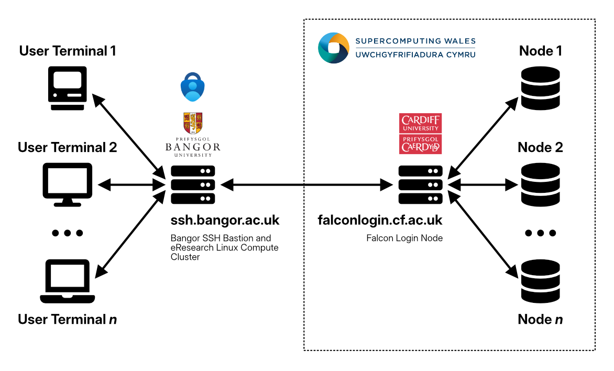

# ICE 4131 High Performance Computing - Lab 2

**Tutor:** Peter Butcher ([p.butcher@bangor.ac.uk](mailto:p.butcher@bangor.ac.uk))

**Lab Assistants**:

- Daniel Farmer ([d.farmer@bangor.ac.uk](mailto:d.farmer@bangor.ac.uk))

### Objectives

_**NOTE:** If you have not completed the tasks from [Lab 1](../lab1/README.md), you should complete those first!_

Today’s lab will introduce you to [SLURM](https://slurm.schedmd.com/documentation.html) (Simple Linux Utility for Resource Management), a free and open-source job scheduler for Linux and Unix-like operating systems. It is mainly used by supercomputers and computer clusters. In today's lab, you will learn how to use it to submit your work to Supercomputing Wales' supercomputer: https://supercomputing.wales

### Task List

Today's tasks are as follows:

1. [SCW Topology](#step-1-scw-topology)
2. [Creating a job](#step-2-creating-a-job)
3. [Run your code from lab 1 on the supercomputer](#step-3-run-your-code-from-lab-1-on-the-supercomputer)
4. [Working with remote files locally](#step-4-working-with-remote-files-locally)
5. [Passwordless access to the Supercomputer](#step-5-passwordless-access-to-the-supercomputer)

---

## STEP 1: SCW Topology

So far you have executed your programs using `./PROGRAM_NAME`, e.g.:

```bash
./helloworld
```

The overall topology of the Falcon supercomputer looks like:



It is not good practice to run your code on the Bangor SSH server or the Falcon login server when using a supercomputer. This is because the execution will be performed on either `ssh.bangor.ac.uk` or `falconlogin.cf.ac.uk` directly, rather than on one of the Falcon compute nodes you can see on the diagram above. **All** users that are currently logged in are using `ssh.bangor.ac.uk` or `falconlogin.cf.ac.uk`, sharing its resources, so every time you run a program there, you are using resources that could be used by other users as they log in. Running large jobs on the login servers can deny some users from even accessing the sueprcomputer completely.

It is therefore essential that you check you're connected to `falconlogin.cf.ac.uk` and use [SLURM](https://slurm.schedmd.com/documentation.html) to make sure your code is running on a dedicated compute node rather than a shared resource. This way you can maximise performance, and you won't annoy other users.

### `sinfo`

The `sinfo` command lists the partitions that are available to you. A partition is a set of compute nodes (computers dedicated to... computing), grouped logically. Typical examples include partitions dedicated to batch processing, debugging, post processing, or visualization. Try to run the `sinfo` command and see if you can work out what this readout does.

You should see output similar to:

```bash
PARTITION         AVAIL  TIMELIMIT  NODES  STATE NODELIST
compute*             up 3-00:00:00      4   resv cca[0010,0014-0015,0017]
compute*             up 3-00:00:00      5    mix cca[0002-0004,0013,0018]
compute*             up 3-00:00:00      8  alloc cca[0001,0005-0009,0011-0012]
compute*             up 3-00:00:00      1   idle cca0016
gpu_l40s             up 3-00:00:00      2    mix ccigl[0001-0002]
gpu_h100             up 3-00:00:00      1    mix ccigh0001
gpu_h200             up 3-00:00:00      1    mix ccigh0002
gpu_v100             up 3-00:00:00     12   idle hawkccs[2101-2112]
gpu_v100_dev         up      20:00      1 drain$ hawkccs2115
ondemand_gpu_v100    up   12:00:00      2   idle hawkccs[2113-2114]
highmem              up 3-00:00:00      1   mix- ccah0005
highmem              up 3-00:00:00      1    mix ccah0006
highmem              up 3-00:00:00      6  alloc ccah[0001-0004,0007-0008]
htc_genoa            up 3-00:00:00      1   resv cca0025
htc_genoa            up 3-00:00:00     10    mix cca[0019-0021,0024,0027-0028,0033-0035,0038]
htc_genoa            up 3-00:00:00      8  alloc cca[0022-0023,0026,0029-0030,0036-0037,0039]
compute_rome         up 3-00:00:00      1  maint hawkcca0027
compute_rome         up 3-00:00:00      2 drain* hawkcca[0015-0016]
compute_rome         up 3-00:00:00      1  drain hawkcca0018
compute_rome         up 3-00:00:00      4    mix hawkcca[0023-0024,0026,0028]
compute_rome         up 3-00:00:00      6  alloc hawkcca[0017,0019-0022,0025]
htc_rome             up 3-00:00:00      1  maint hawkcca0008
htc_rome             up 3-00:00:00      2 drain* hawkcca[0005,0007]
htc_rome             up 3-00:00:00      3  drain hawkcca[0003-0004,0012]
htc_rome             up 3-00:00:00      2    mix hawkcca[0010,0013]
htc_rome             up 3-00:00:00      6  alloc hawkcca[0001-0002,0006,0009,0011,0014]
ondemand_rome        up   12:00:00      4   idle hawkcca[0029-0032]
dev                  up    1:00:00      2   idle cca[0040-0041]
```

The command `sinfo` can output the information in a node-oriented fashion, with the argument `-N -l`. Try them:

```bash
sinfo -N -l
```

Expected output is similar to the following for Hawk:

```bash
Tue Sep 10 10:06:53 2026
NODELIST     NODES         PARTITION       STATE CPUS    S:C:T MEMORY TMP_DISK WEIGHT AVAIL_FE REASON
cca0001          1          compute*   allocated 192    2:96:1 770000        0      1   (null) none
cca0002          1          compute*       mixed 192    2:96:1 770000        0      1   (null) none
cca0003          1          compute*       mixed 192    2:96:1 770000        0      1   (null) none
...
cca0019          1         htc_genoa       mixed 192    2:96:1 770000        0      1   (null) none
cca0020          1         htc_genoa       mixed 192    2:96:1 770000        0      1   (null) none
cca0021          1         htc_genoa       mixed 192    2:96:1 770000        0      1   (null) none
...
cca0040          1               dev        idle 192    2:96:1 770000        0      1   (null) none
cca0041          1               dev        idle 192    2:96:1 770000        0      1   (null) none
ccah0001         1           highmem   allocated 192    2:96:1 154400        0      1   (null) none
ccah0002         1           highmem   allocated 192    2:96:1 154400        0      1   (null) none
ccah0003         1           highmem   allocated 192    2:96:1 154400        0      1   (null) none
...
ccigh0001        1          gpu_h100       mixed 64     2:32:1 103170        0      1   (null) none
ccigh0002        1          gpu_h200       mixed 64     2:32:1 103170        0      1   (null) none
ccigl0001        1          gpu_l40s       mixed 64     2:32:1 103170        0      1   (null) none
ccigl0002        1          gpu_l40s       mixed 64     2:32:1 103170        0      1   (null) none
hawkcca0001      1          htc_rome   allocated 64     2:32:1 257516        0      1   (null) none
hawkcca0002      1          htc_rome   allocated 64     2:32:1 257516        0      1   (null) none
hawkcca0003      1          htc_rome     drained 64     2:32:1 257516        0      1   (null) DS-Check_EAR_issue :
hawkcca0005      1          htc_rome    drained* 64     2:32:1 257516        0      1   (null) CMOS_DEAD
```

You can see many interesting pieces of information in these readouts, note the final four lines in this example which included some nodes from Hawk, two of which have current known issues.

The reference for available partitions on Falcon can be found here:

- [Falcon Partition Overview](https://bangoroffice365.sharepoint.com/sites/DigitalServices/SitePages/The-Falcon-Supercomputer---Partitions.aspx)

Generally, you can use:

- `htc_genoa` or `htc_rome` for single-threaded, serial CPU jobs
- `compute` for parallel CPU tasks

You will need to know which partitions to use for which jobs when you write your SLURM scripts later.

### `squeue`

The `squeue` comamnd shows the list of jobs that are currently running, these are either:

- Running, denoted as `R`
- Waiting for resources, denoted as `PD` (pending)

Try it:

```bash
squeue
```

You should see all the current jobs. In most cases, you are only interested in yours. You can add the following to the `squeue` command to list just your jobs: `-u $USER`. The `-u` flag takes one argument, a username, and `$USER` reads your username from an environment variable to save you typing it out yourself, try it:

```bash
squeue -u $USER
```

If you are waiting for a script to finish before moving on it can be helpful to `watch` the squeue:

```bash
watch squeue -u $USER
```
this will run squeue every 2 seconds by default. When your squeue is empty press `^ + c` or `Ctrl + c` 

Expected output, once you have submitted jobs, is similar to:

```bash
JOBID PARTITION     NAME     USER ST       TIME  NODES NODELIST(REASON)
7364890      work     test ptb18xhf PD       0:00      1 (None)
7364888      work     test ptb18xhf  R       0:02      1 bwc053
7364889      work     test ptb18xhf  R       0:02      1 bwc053
$
```

The `ST` column denotes a job's state, typically either `PD` or `R`:

- `PD`: Pending (awaiting allocation)
- `R`: Running (monitor the `TIME` column once a job starts running, is it running for an expected length of time?)

---

## STEP 2: Creating a job

A job consists of two things:

1. **Resource requests**, which consist of a number of CPUs, the expected duration of computation and the amount of required RAM or disk space etc.
2. **Job steps** describe the tasks that must be done, software which must be run.

It's time to create a job.

Ensure you are in your home directory with `cd ~`. This is a shortcut to navigating to the root of your working directory on the supercomputer, also known as 'home'.

Create a new directory in your home directory called `lab2` using the `mkdir` command.
Go into that directory using the `cd` command. Use `nano` to create a file named `submit.sh`:

```bash
nano submit.sh
```

The file should contain the following:

```bash
#!/bin/bash --login
#
#SBATCH --job-name=my_test                  # Job name
#SBATCH --account=SCWF00238_p_butcher_233   # SCW project code
#SBATCH --partition=htc_genoa               # Partition
#SBATCH --ntasks=1                          # Run a single task
#SBATCH --ntasks-per-node=1
#SBATCH --cpus-per-task=1
#SBATCH --nodes=1
#SBATCH --mem=600mb                         # Total memory limit
#SBATCH --time=00:15:00                     # Time limit hrs:min:sec

echo HOSTNAME:
hostname

echo CONTENTS OF HOME DIRECTORY:
ls $HOME

echo WAIT 15 SECONDS
sleep 15s

echo EXIT
```

This short program sets up a batch job on the supercomputer, prints the hostname and the contents of your home directory to the terminal window, then sleeps for 15s before exiting. Note the following:

- `--account=SCWF00238_p_butcher_233`, can be substituted by running the program with the following flag: `-A SCWF00238_p_butcher_233`. An account is required to run a job.
- `--partition=htc_genoa`, not specifying an appropriate partition will default to `htc_genoa`, refer to the [Falcon Partition Overview](https://bangoroffice365.sharepoint.com/sites/DigitalServices/SitePages/The-Falcon-Supercomputer---Partitions.aspx).

> **PRO TIP:**  
> If you don't want to remember the project code `SCWF00238_p_butcher_233` each time, modify the file `.bashrc` in your home directory:
>
> - Run `chmod +w .bashrc` in your home directory to add the write permission to the file
> - Add the following line to .bashrc:
>
> ```bash
> export PROJECT=SCWF00238_p_butcher_233
> ```
>
> After saving, run the `bash` command. Now the environment variable `$PROJECT` is available every time you need to refer to the SCW project code. If you follow this step, you can replace line 4 of `submit.sh` with:
>
> ```bash
> #SBATCH --account=$PROJECT
> ```

Optionally, before you launch your job, type:

```bash
export SCW_TPN_OVERRIDE=1
```

This is because we are only using 1 thread in this case and do not want to lock out more resource than we need.

To launch your first job, you need to use `sbatch` as follows:

```bash
sbatch submit.sh
```

In the console, you will see the job number, e.g.:

```bash
Submitted batch job 2825285
```

A file, `slurm-2825285.out` (with your job number) will be created. To visualize its content, type:

```bash
more slurm-2825285.out
```

---

## STEP 3: Run your code from lab 1 on the supercomputer

To run your code from lab 1 on the supercomputer, follow these steps:

- Navigate to the directory where your programs for lab 1 are located. Use the `cd` command to change directory, and `ls` to check the content of the directory.
- Copy the content of `helloworld-pthread3.cxx` into your `lab2` directory and name the file `helloworld-pthread4.cxx`.
- The user (_you_) should be able to set the number of threads using command line arguments, so to do this, modify the main function accordingly. Here's an example:

```c++
#include <cstdlib> // For "atoi"

// The atoi function converts a string into an integer

using namespace std;

int main(int argc, char** argv) {
  if (argc != 2) {
    cerr << "Usage: " << argv[0] << "\t" << "N   [N = number of threads]" << endl;
    return EXIT_FAILURE;
  }

  // Create a variable to store the number of threads passed in the arguments: N
  int N = atoi(argv[1]);

  // Your code goes here!
  // Use N to update the number of threads to use

  return 0;
}
```

- Compile your code using:

```bash
g++ helloworld-pthread4.cxx -lpthread -o helloworld-pthread4
```

- Create a new file named `submit.sh` containing:

```bash
#!/bin/bash --login
#
#SBATCH --job-name=my_test           # Job name
#SBATCH -A SCWF00238_p_butcher_233   # SCW project code
#SBATCH --partition=htc_genoa.       # Partition
#SBATCH --ntasks=1                   # Run a single task
#SBATCH --ntasks-per-node=1
#SBATCH --cpus-per-task=1
#SBATCH --nodes=1
#SBATCH --mem=600mb                  # Total memory limit
#SBATCH --time=00:15:00              # Time limit hrs:min:sec

./helloworld-pthread4 $SLURM_CPUS_PER_TASK
```

- To launch the job, use the following code, replacing **`N`** with a number between 1 and 40:

```bash
sbatch -c N submit.sh
```

We use an environment variable, `SLURM_CPUS_PER_TASK`. It corresponds to the number of threads that you want to use. We requested one computing node with `#SBATCH --nodes=1`, and the maximum number of CPU cores is 40. Now, test your code with various numbers of threads (update `N`) and check the contents in the output files. Note that you do not need to create a new submit.sh for each test, you can re-use it in this case!

---

## STEP 4: Working with remote files locally

Now that you should be fairly up to speed with `nano`, `emacs`, `vi`, or `vim`, depending on which you have been using, we will now learn how to use Visual Studio Code [VSCode](https://code.visualstudio.com) to make changes to our remote files, from our [personal](#personal-machines) and [university](#university-machines) machines:

### Personal Machines

To use VSCode using your own personal machine:

- On windows, the default location of the OpenSSH config file is at: `%programdata%\ssh\sshd_config` ([read more](https://learn.microsoft.com/en-us/windows-server/administration/openssh/openssh-server-configuration#openssh-configuration-files)). Add the following code to your OpenSSH config, updating `YourBangorUsername` and `YourFalconUsername` accordingly:

```bash
# Bangor University SSH Gateway
Host bangor-gateway
    HostName ssh.bangor.ac.uk
    User YourBangorUsername
    Port 22

# Falcon Supercomputer
Host falcon
    HostName falconlogin.cf.ac.uk
    User YourFalconUsername
    Port 22
    ProxyJump bangor-gateway
```

- For Mac/Linux, follow the **Advanced: Automating Part of Connecting to Falcon by Using a Jump Host** instructions under "Connect Using a Terminal (Linux/Mac)" [here](<https://bangoroffice365.sharepoint.com/sites/DigitalServices/SitePages/eResearch---Access-to-the-Hawk-Supercomputer.aspx#connecting-using-a-terminal-(linux-mac)>).

Once your SSH config is configured on Windows/Linux/Mac, you will be able to login to Falcon using a single command:

```bash
ssh falcon
```

Enter your Bangor password first, approve the Bangr MFA request on your phone, and when prompted, enter your SCW password.

### University Machines

To use VSCode using the university machines:

- Navigate to: File -> Preferences -> Backup & Sync
- Sign in.
- Once signed in, your settings will be synchronised between any machines you sign in to.

The SSH configuration is **not** included in the settings sync by default. To address this, we can configure VS Code to always reference the same SSH configuration path. If we store the SSH config file on the university M: drive, it will be accessible from any machine across the university:

- Press `Ctrl`+`Shift`+`P` and select Remote-SSH: Open SSH Configuration File.
- Go to Settings and specify a path like `M:\.ssh\config`.
- VS Code will auto-create the file (including the necessary parent directories), and this setting will now sync along with your other preferences.
- Ensure the file is populated with the SSH config [above](#personal-machines).
- While you will still need to sign in on each new machine, this method avoids the hassle of manually editing the SSH configuration file on multiple machines.

This is still an experimental feature and may not work all of the time. Ensure you are running an up to date version of VSCode and report any issues to the module organiser.

---

## STEP 5: Passwordless access to the Supercomputer

You can set up SSH keys on your operating system for passwordless entry to the supercomputer. All you need to do after setting this up is enter your Bangor credentials and accept the MFA request.

- Windows: Follow **Advanced** instructions under "Connect using PuTTy (Windows)" [here](<https://bangoroffice365.sharepoint.com/sites/DigitalServices/SitePages/eResearch---Access-to-the-Hawk-Supercomputer.aspx#connecting-using-putty-(windows)>).
- Linux/Mac: Follow step 3 of the **Advanced** instructions under "Connect Using a Terminal (Linux/Mac)" [here](<https://bangoroffice365.sharepoint.com/sites/DigitalServices/SitePages/eResearch---Access-to-the-Hawk-Supercomputer.aspx#connecting-using-a-terminal-(linux-mac)>).

You can now log into Falcon without your SCW password.

**This concludes lab 2**
